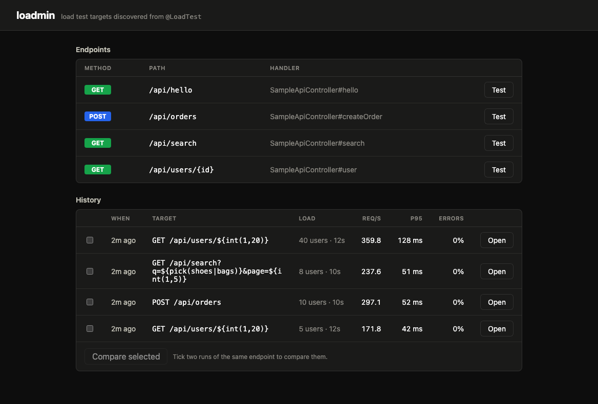
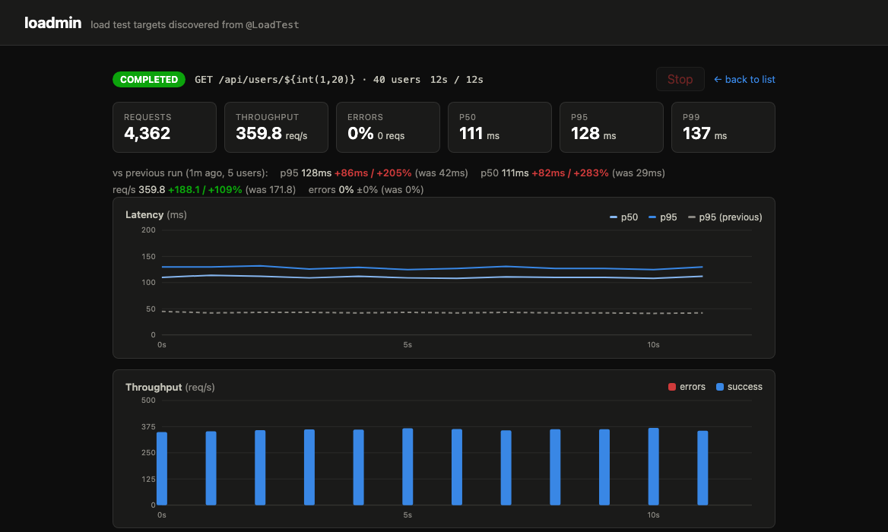
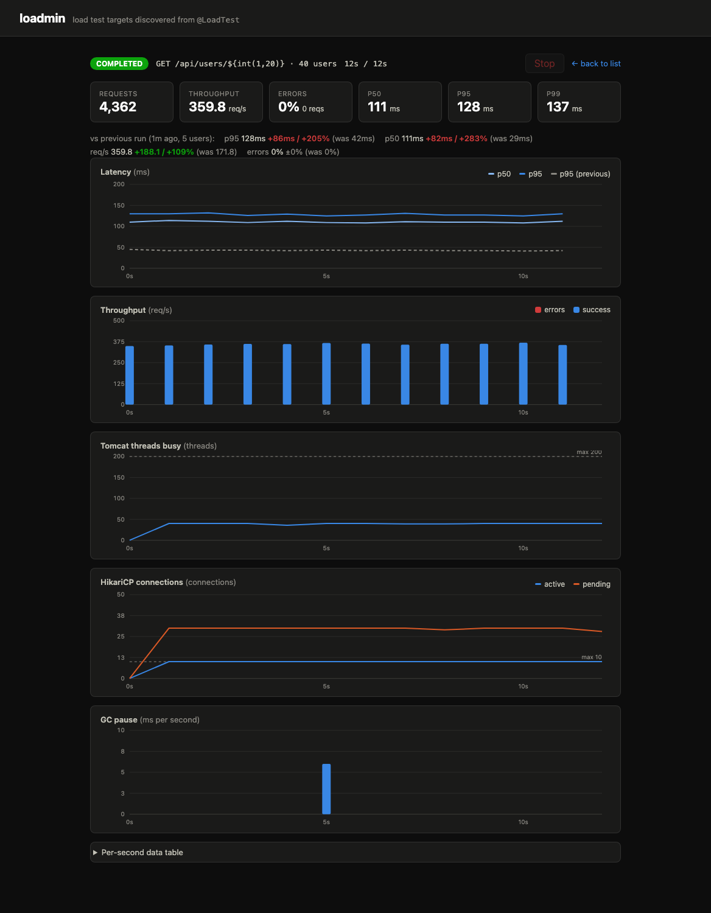
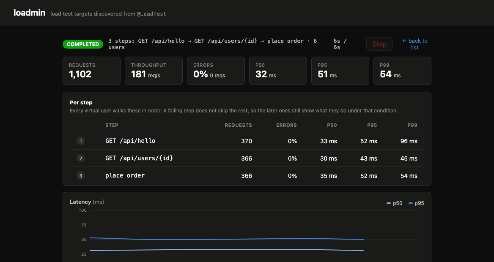
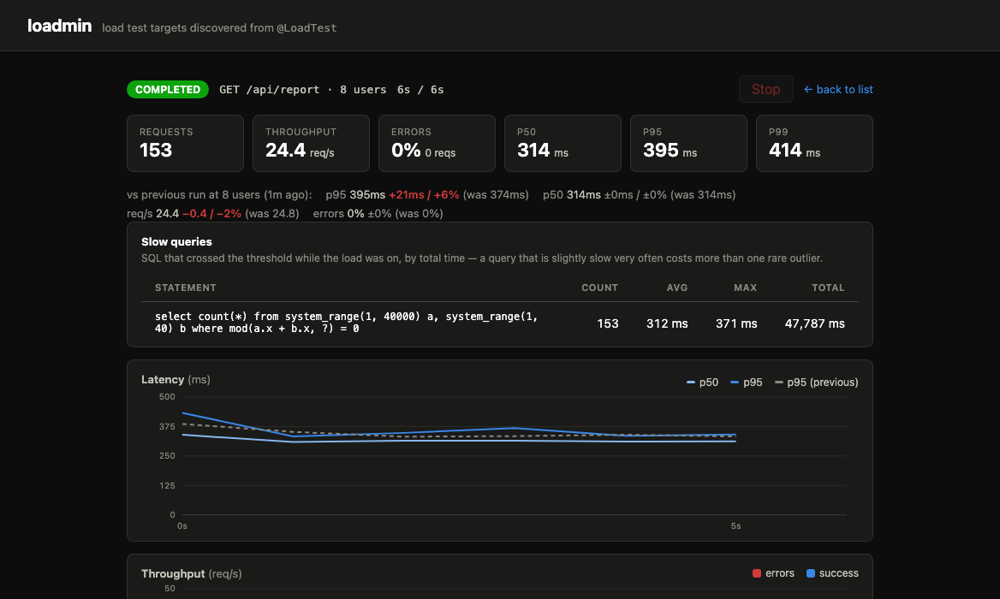
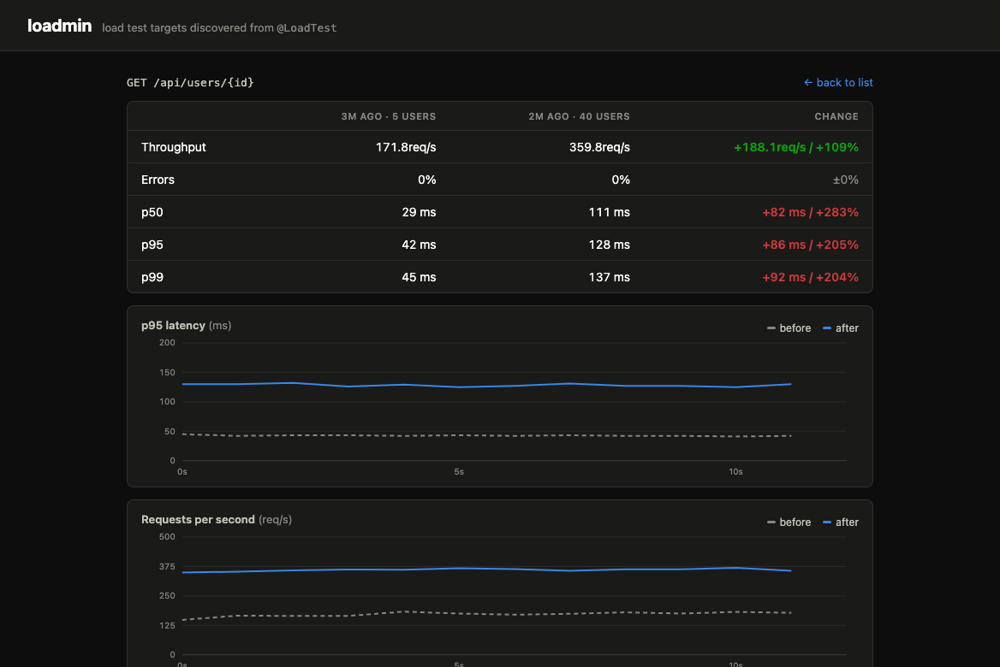

# loadmin

[](https://central.sonatype.com/artifact/io.github.ghals5737/loadmin-spring-boot-starter)
[](LICENSE)

> ⚠️ **Work in progress** — the load engine, live results, server metric
> overlays, request templates, scenarios, slow query capture, run history and
> script export all work. The API may still move before 1.0.

Annotation-driven load testing UI for Spring Boot — like Swagger UI, but for load tests.

Put `@LoadTest` on a controller handler, start your app, and open `/loadmin`:
a load testing web page is exposed automatically. Unlike external tools (k6, Gatling,
JMeter), loadmin lives **inside** your application, so it can overlay server-side
metrics (Tomcat thread pool, HikariCP connection pool, GC pauses) on top of the
latency graph while the load is running.

## Installation

```kotlin
// build.gradle.kts
implementation("io.github.ghals5737:loadmin-spring-boot-starter:0.2.2")
```

```xml
<dependency>
    <groupId>io.github.ghals5737</groupId>
    <artifactId>loadmin-spring-boot-starter</artifactId>
    <version>0.2.2</version>
</dependency>
```

> 0.2.0 changed the stored run format, so history written by 0.1.0 is skipped
> rather than read.

## Quick start

```java
@RestController
public class UserController {

    @LoadTest(path = "/api/users/${int(1,20)}")
    @GetMapping("/api/users/{id}")
    public User user(@PathVariable long id) { ... }
}
```

```yaml
# application.yml — loadmin is disabled by default; explicit opt-in required
loadmin:
  enabled: true
```

Then open `http://localhost:8080/loadmin`. Every `@LoadTest` handler is listed,
along with the runs you have already made:



Pick an endpoint, set concurrent users and duration, and start. You get live
p50/p95/p99 latency, throughput and error rate — plus how this run compares to
the last one on the same endpoint:



And, aligned on the same time axis, what the server was doing while it took the
load — here 40 virtual users against a 10-connection Hikari pool, with 30
requests queued for a connection at any moment:



### Request templates

A load test that calls the same URL for every request measures your caches, not
your endpoint. Paths, query strings and JSON bodies are templates, re-rendered
per request:

| Placeholder | Renders |
|-------------|---------|
| `${int(1,20)}` | a random integer, both bounds included |
| `${cycle(1,500)}` | the same range walked in order and wrapped |
| `${seq}`, `${seq(1000)}` | an increasing counter, shared by all virtual users |
| `${uuid}` | a random UUID |
| `${alpha(8)}` | a random `[a-z0-9]` string |
| `${pick(a\|b\|c)}` | one of the given values |
| `${now}` | epoch milliseconds |

```java
@LoadTest(
        path = "/api/orders?channel=${pick(web|app)}",
        body = "{\"item\": \"${pick(shoes|bags)}\", \"qty\": ${int(1,5)}}")
@PostMapping("/api/orders")
public Order create(@RequestBody OrderRequest request) { ... }
```

`int` and `cycle` both stay inside a range; the difference is coverage. `int`
draws at random, so over 500 requests some keys are hit several times and others
not at all. `cycle` walks the range in order, so every key is used equally often
— which is what you want when the range is there to bound what a write test
creates:

```java
@LoadTest(body = "{\"orderNo\": \"LT-${cycle(1,500)}\", \"qty\": ${int(1,5)}}")
@PostMapping("/api/orders")
public Order create(@RequestBody OrderRequest request) { ... }
```

That test touches 500 order numbers and no more, and the `LT-` prefix makes them
one `delete from orders where order_no like 'LT-%'` away from gone. loadmin never
deletes anything itself — it only sends requests, and it has no way to know what
they created.

The annotation only supplies the defaults — the UI shows rendered samples as you
type and everything stays editable there. Only endpoints carrying `@LoadTest`
can be targeted, and generated values can never contain path or query characters,
so a template cannot be used to reach a different endpoint.

### Running the load from somewhere else

The built-in generator shares a JVM with the application it measures, so its
numbers are for local exploration rather than rigorous benchmarking. When the
numbers need to hold up, export the same test and run it from another process:

```bash
BASE_URL=http://localhost:8080 k6 run loadmin-api-users-id.js
```

`Export k6` and `Export Gatling` on the config screen hand the target, the
templates and the load settings to that runner — k6 as a self-contained script
with no jslib imports, Gatling as a single Java DSL simulation. loadmin then
does what only it can: show the server's insides while the load arrives from
outside.

One thing changes on the way out: k6 gives every virtual user its own JS
runtime, so `${seq}` becomes a per-user counter (each starting far enough apart
to stay distinct). The generated script says so. Gatling runs in one JVM and
keeps a single shared sequence.

### Requests that need a token

Most APIs answer 401 without one, and a load test against that measures how fast
the app rejects you. Put the header in the **Headers** box on the config screen
and it rides along with every step:

```
Authorization: Bearer eyJhbGciOi...
```

They live in the run only. The spec written to history has no room for them, so
a token cannot end up in a file on disk, and exported scripts read secrets from
the environment instead of embedding them:

```bash
AUTHORIZATION="Bearer eyJ..." BASE_URL=https://dev.example.com k6 run loadmin-api-secure.js
```

Header values may not contain line breaks — a value that could append headers of
its own is rejected rather than cleaned up.

### Scenarios

Real traffic is a flow, not one endpoint. Add steps on the config screen and
every virtual user walks them in order, over and over, for the duration of the
run — and each step is measured on its own, because an overall p95 hides which
call is the slow one:



A failing step does not skip the rest: if the login 500s, the calls after it
still run, which is usually the thing you wanted to see. Exported k6 scripts
wrap each step in a `group`, and Gatling simulations chain them with `.exec`.

### Slow queries

The metric overlay says the connection pool was busy; it does not say which
statement kept it busy. With capture on, the SQL that crossed a threshold while
the load was on is listed with the run — ranked by total time, because a
statement that is slightly slow very often costs more than one rare outlier:



```yaml
loadmin:
  slow-query:
    enabled: true      # off by default: this wraps your DataSource
    threshold: 50ms
```

It is off by default on purpose. Collecting the SQL means putting a wrapper
around the application's own `DataSource`, and a load testing tool should not do
that to you unasked. While no run is going, the wrapper passes every call
straight through.

### Run history

Finished runs are stored as JSON under `.loadmin/history`, so results survive a
restart. A run is compared against the last one on the same endpoint
automatically — the deltas sit under the summary and the previous p95 is
overlaid on the latency chart — and any two runs of an endpoint can be put
side by side:



Runs and comparisons have their own URLs (`/loadmin/index.html#run/<id>`,
`#compare/<id>,<id>`), so a result can be linked to in a PR or a chat.

### A note for Kotlin projects

`@Configuration` classes are proxied with CGLIB, which needs a constructor it can
call. A Kotlin default value on an injected field produces a synthetic
constructor instead and startup fails with `No default constructor found`. Drop
the default — `@Value("\${loadmin.enabled:false}")` already has its own fallback:

```kotlin
@Configuration
class SecurityConfiguration(
    @Value("\${loadmin.enabled:false}") private val loadminEnabled: Boolean,   // no `= false`
)
```

### Configuration

| Property | Default | Description |
|----------|---------|-------------|
| `loadmin.enabled` | `false` | Required opt-in; nothing is registered without it |
| `loadmin.max-concurrency` | `200` | Upper bound for concurrent users in a run |
| `loadmin.max-duration-seconds` | `300` | Upper bound for a run's duration |
| `loadmin.history.enabled` | `true` | Write finished runs to disk |
| `loadmin.history.dir` | `.loadmin/history` | Where run files are written |
| `loadmin.history.max-runs` | `100` | Runs to keep; the oldest are deleted |
| `loadmin.slow-query.enabled` | `false` | Wrap the DataSource to capture slow SQL during runs |
| `loadmin.slow-query.threshold` | `100ms` | Statements at least this slow are recorded |

### Server metric overlay

The overlay reads from the app's Micrometer `MeterRegistry`:

| Chart | Meters | Needs |
|-------|--------|-------|
| Tomcat threads busy | `tomcat.threads.*` | actuator + `server.tomcat.mbeanregistry.enabled=true` |
| HikariCP connections | `hikaricp.connections.*` | actuator + a pooled DataSource |
| GC pause | `jvm.gc.pause` | actuator |

Without a `MeterRegistry` bean the load test still works; you just get the
client-side charts only.

## Try the demo

The repository ships a small application with `@LoadTest` endpoints covering
path, query and body templates, and a deliberately small HikariCP pool so the
metric overlay has something to show:

```bash
./gradlew :loadmin-demo:bootRun
```

Then open <http://localhost:8080/loadmin>. The annotations that drive it are in
[`SampleApiController`](loadmin-demo/src/main/java/io/github/ghals5737/loadmin/demo/SampleApiController.java).

## ⚠️ Do not enable in production

loadmin generates load against your own application. Enabling it in production is
a self-DDoS button. It stays completely inactive (no beans registered) unless
`loadmin.enabled=true` is set explicitly.

Note that the built-in load generator runs in the same JVM as your application.
Numbers are useful for local/dev exploration, not for rigorous benchmarking —
an external-runner mode (k6/Gatling script export) is on the roadmap.

## Modules

| Module | Description |
|--------|-------------|
| `loadmin-core` | `@LoadTest` annotation, endpoint scanner, load engine, templates, history |
| `loadmin-ui` | Static web resources for the `/loadmin` UI |
| `loadmin-spring-boot-starter` | Auto-configuration |
| `loadmin-demo` | Sample app for local verification (not published) |

## License

[Apache License 2.0](LICENSE)
